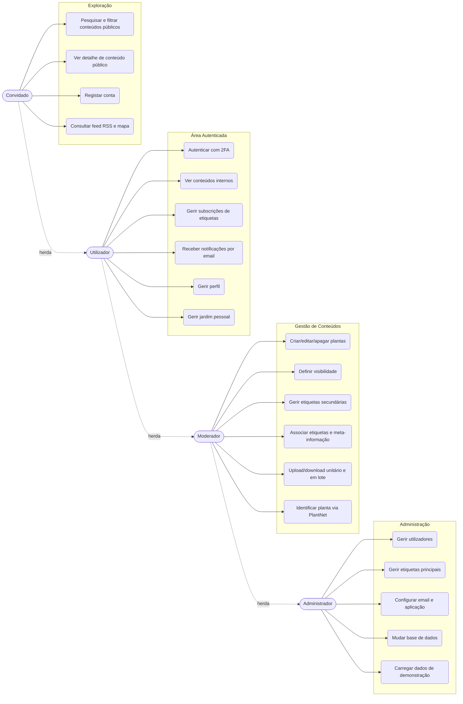
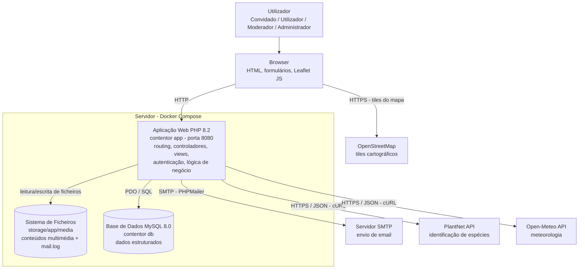
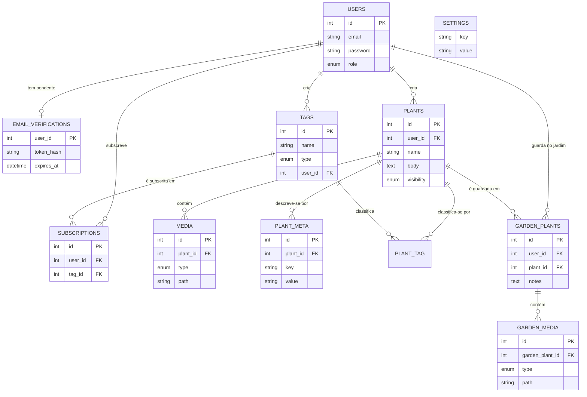

# Rooted — Sistema de Gestão de Conteúdos Multimédia

**Relatório Final do Trabalho Prático**

Instituto Superior de Engenharia de Lisboa
Departamento de Engenharia Informática
Sistemas Multimédia para a Internet — Semestre de Verão 2025

André Fonseca, <a39758@alunos.isel.pt>
Daniel Santos, <a32078@alunos.isel.pt>
Grupo 25 — Turma 62D

Professor Carlos Gonçalves

---

## 1. Introdução

O presente relatório documenta o trabalho prático da unidade curricular de Sistemas Multimédia para a Internet, cujo objetivo é o estudo de Sistemas de Gestão de Conteúdos (SGC / _Content Management System_ — CMS) e o desenvolvimento de um sistema de partilha de conteúdos multimédia acessível exclusivamente via browser. O tr
abalho foi realizado em três fases: a análise do problema e de soluções CMS existentes (Fase 1), o desenvolvimento da aplicação web (Fase 2) e os testes que comprovam o correto funcionamento da aplicação (Fase 3). Este documento integra as três fases num único relatório coerente.

O sistema desenvolvido, designado **Rooted**, é um SGC orientado à partilha de conteúdos multimédia (fotografias, vídeos e áudio) no domínio da jardinagem e botânica, implementado de raiz em PHP, com armazenamento de informação estruturada em MySQL e de ficheiros multimédia no sistema de ficheiros do servidor.

O relatório está organizado da seguinte forma:

- O **Capítulo 2 — Princípios / Enquadramento** introduz os conceitos fundamentais de CMS e _web services_ que enquadram o trabalho;
- O **Capítulo 3 — Análise Comparativa dos CMS Escolhidos** apresenta e compara três soluções CMS existentes (Django CMS, October CMS e WordPress) com a solução proposta;
- O **Capítulo 4 — Proposta de Desenvolvimento do Sistema** descreve o conceito do sistema Rooted, os perfis de utilização e as principais decisões de desenho;
- O **Capítulo 5 — Funcionalidades do Sistema** detalha as funcionalidades implementadas, organizadas por perfil de utilizador e complementadas por um diagrama de casos de utilização;
- O **Capítulo 6 — Arquitetura / Módulos / Componentes** descreve a arquitetura da solução, do contexto geral aos componentes internos, incluindo os fluxos de sincronização entre módulos;
- O **Capítulo 7 — Estrutura de Dados** apresenta primeiro o modelo conceptual Entidade–Associação e, em seguida, a descrição detalhada das tabelas e relações;
- O **Capítulo 8 — Testes e Validação** apresenta a metodologia de testes e os casos de teste, cobrindo casos de utilização corrente e casos especiais;
- O **Capítulo 9 — Conclusões** sintetiza os resultados alcançados e o trabalho futuro;
- O **Capítulo 10 — Anexos** inclui material complementar, nomeadamente o esquema XML utilizado nas operações em lote.

## 2. Princípios / Enquadramento

Um CMS é um _software_ desenhado para criar e modificar conteúdo em _websites_ através de uma interface intuitiva para o utilizador e sem exigir conhecimentos técnicos avançados. Algumas das características principais são: permitir a publicação de conteúdos, _search engine optimization_ (SEO) e controlo de acessos dos utilizadores.

Um _web service_ permite que diferentes sistemas comuniquem entre si pela Internet. Estes sistemas podem ser desde um servidor Linux ou Windows, um _mainframe_, um _desktop_ ou, simplesmente, um _smartphone_. Estas interações têm usualmente como base o modelo cliente/servidor, onde o cliente envia uma mensagem para o servidor e espera pela sua resposta enquanto o servidor executa determinado processo.

As comunicações entre sistemas só são possíveis quando realizadas numa linguagem comum. Os dados podem ser transferidos no formato XML, JSON ou outro formato de texto, enquanto cada aplicação pode ser escrita em diferentes linguagens como .NET, Java ou Python.

Existem dois tipos principais de _web services_: _Simple Object Access Protocol_ (SOAP), baseado em XML, e _Representational State Transfer_ (REST), que utiliza o protocolo HTTP para aceder a recursos. Os serviços REST seguem quatro princípios: dados e funcionalidades são acedidos através de recursos identificados por um _Uniform Resource Identifier_ (URI); os recursos são manipulados por um número fixo de operações (GET, POST, PUT e DELETE) que, respetivamente, solicitam, criam, atualizam e apagam um recurso; os recursos podem ser representados em múltiplos formatos como HTML, XML, texto e JSON; e a comunicação é _stateless_, isto é, o servidor não guarda estado sobre o cliente. Estes princípios garantem aplicações simples, leves e rápidas.

Estes conceitos enquadram diretamente o sistema desenvolvido: o Rooted é um CMS acessível via browser que consome _web services_ REST externos (identificação de plantas e meteorologia) e expõe conteúdos em formatos normalizados (RSS/XML).

## 3. Análise Comparativa dos CMS Escolhidos

Nesta secção apresentam-se três solu
ções CMS existentes que permitiriam implementar um sistema equivalente ao desenvolvido, comparando-as com a solução proposta.

### 3.1. Django CMS

Django é uma _web framework_ para desenvolver aplicações web, cujo foco é maximizar a reutilização de componentes normalmente utilizados em _websites_ e em CMS. A sua linguagem de programação é Python, uma linguagem de grande produtividade, com uma _standard library_ bastante rica.

O Django CMS é desenvolvido sobre esta _framework_ e adiciona funcionalidades de gestão de conteúdos a páginas web fáceis de usar e de manter. O administrador pode alterar facilmente o conteúdo sem conhecimento técnico e sem risco de modificar o código-fonte do próprio _website_. A sua principal funcionalidade é a personalização de conteúdos em _templates_ através de áreas de _placeholder_, com sistema de gestão de sessão e autenticação pré-configurado e um painel de administração pronto a utilizar. O ecossistema permite ainda integrar outras aplicações através de _apphooks_.

### 3.2. October CMS

October é um CMS desenvolvido em PHP sobre a _framework_ Laravel. A estrutura de dados e a interface de utilizador são definidas em ficheiros YAML (_blueprints_): _Sections_ definem o conteúdo de secções (blogs, produtos), _Collections_ definem dados comuns (autores, categorias) e _Globals_ definem configurações disponíveis a nível universal.

O October apresenta um editor _online_, requer poucas linhas de código para construir uma interface gráfica e suporta as bases de dados MySQL, SQLite e PostgreSQL. A sua arquitetura é orientada a eventos, facilitando o desenvolvimento de funcionalidades extra, e inclui suporte para redes de distribuição de conteúdos (CDN), _cropping_ de imagens e gestão de ficheiros através de um editor WYSIWYG que dispensa conhecimentos de programação.

### 3.3. WordPress

WordPress é um CMS _open-source_ extremamente popular, utilizado por aproximadamente 64% do mercado, com uma comunidade bastante ativa que contribui para o seu desenvolvimento contínuo. Os utilizadores não necessitam de conhecimentos de programação, é fácil de configurar tirando partido dos diversos temas disponíveis e possui uma vasta coleção de _plugins_ que facilita a integração de novas funcionalidades. Suporta gestão e configuração de diferentes tipos de utilizadores e vários tipos de _media_.

### 3.4. Comparação com a Solução Proposta

A Tabela 1 compara as funcionalidades exigidas pelo enunciado nas três soluções analisadas e na implementação própria desenvolvida neste trabalho.

**Tabela 1 — Comparação de funcionalidades entre os CMS analisados e a solução proposta**

| Funcionalidade                      | Django CMS             | October CMS            | WordPress       | Rooted (PHP de raiz)                   |
| :---------------------------------- | :--------------------- | :--------------------- | :-------------- | :------------------------------------- |
| Tecnologia                          | Python                 | PHP (Laravel)          | PHP             | PHP (sem _framework_)                  |
| Gestão de perfis de utilizador      | Sim (nativo)           | Sim (nativo)           | Sim (_plugins_) | Implementação via `$_SESSION` e PDO    |
| Partilha de conteúdo multimédia     | Sim                    | Sim                    | Sim             | Sistema de ficheiros + metadados em BD |
| Categorias (principais/secundárias) | Sim (nativo)           | Sim (nativo)           | Sim (_plugins_) | Tabelas relacionais em MySQL           |
| Pesquisa por meta-informação        | Sim                    | Sim                    | Sim             | Consultas SQL parametrizadas           |
| Notificações por email              | Sim (extensões)        | Sim (_plugins_)        | Sim (_plugins_) | SMTP via PHPMailer                     |
| Upload em lote (ZIP)                | Requer desenvolvimento | Requer desenvolvimento | Sim (_plugins_) | `ZipArchive` e `SimpleXML`             |
| Criação de _feeds_ RSS              | Sim (nativo)           | Sim (_plugins_)        | Sim (nativo)    | Geração manual de XML/RSS              |
| Visualização em mapa                | Sim (extensões)        | Sim (_plugins_)        | Sim (_plugins_) | Leaflet + OpenStreetMap                |
| Consumo de _web services_ externos  | Sim                    | Sim                    | Sim             | cURL/JSON (PlantNet, Open-Meteo)       |

Da análise da tabela conclui-se que qualquer das três soluções permitiria implementar o sistema pretendido, recorrendo em vários casos a _plugins_ ou extensões. A opção por uma implementação de raiz em PHP justifica-se pelos objetivos pedagógicos do trabalho: consolidar os conhecimentos sobre a infraestrutura da linguagem, controlar integralmente a arquitetura e implementar manualmente mecanismos que num CMS comercial estariam ocultos (sessões, autenticação, acesso à base de dados, processamento de ZIP/XML e integração com _web services_).

## 4. Proposta de Desenvolvimento do Sistema

O projeto **Rooted** consiste no desenvolvimento de um SGC orientado à partilha de conteúdos multimédia no domínio da jardinagem e botânica. A aplicação permite que utilizadores partilhem fotografias, vídeos e áudio relacionados com plantas, jardins e técnicas de cultivo, cada conteúdo acompanhado de descrições textuais e meta-informação relevante. O sistema inclui ainda uma componente de comunidade: cada utilizador autenticado pode manter um jardim pessoal com plantas do catálogo e fotografias próprias do seu progresso.

O website foi desenvolvido a partir de um CMS implementado de raiz em PHP, sem recurso a _frameworks_ de alto nível. A aplicação implementa manualmente mecanismos fundamentais como a gestão de sessões e autenticação através de variáveis globais (`$_SESSION`), a interação direta com a base de dados MySQL utilizando a extensão PDO com consultas parametrizadas (proteção contra injeção de SQL) e a separação entre a apresentação (_views_ HTML) e o processamento de dados (controladores).

O sistema é acedido exclusivamente através de um browser e suporta quatro perfis de utilização com níveis de permissão progressivos: **Convidado**, **Utilizador**, **Moderador** e **Administrador**. O perfil **Moderador** corresponde ao perfil _Simpatizante_ descrito no enunciado do trabalho. A designação foi alterada por refletir com maior precisão o papel deste perfil no contexto da aplicação: para além de criar e gerir conteúdos próprios, o Moderador assume responsabilidades de curadoria, podendo corrigir ou remover conteúdos de outros autores sem depender da intervenção de um Administrador. Esta decisão é detalhada na secção 5.4.

Os conteúdos são organizados por **etiquetas**, divididas em duas categorias: **etiquetas principais**, definidas exclusivamente pelos administradores (ex. "Flores", "Hortícolas", "Suculentas"), e **etiquetas secundárias**, criadas pelos moderadores (ex. "Rega Gota-a-Gota", "Cultivo Interior"). Adicionalmente, os moderadores podem associar **meta-informação** livre a cada conteúdo (tipo de solo, exposição solar, frequência de rega, coordenadas geográficas, entre outros).

Cada conteúdo possui um nível de **visibilidade** que determina quem pode aceder ao mesmo. No enunciado do trabalho esta propriedade é referida como _pública_ ou _privada_; na implementação optou-se pela terminologia **`public`** e **`internal`**. A distinção é intencional: um conteúdo marcado como `internal` não é privado no sentido estrito (visível apenas ao autor), mas sim **visível a qualquer utilizador autenticado** da plataforma. A designação `internal` traduz com maior clareza esta semântica de acesso restrito à comunidade registada.

## 5. Funcionalidades do Sistema

A ideia funcional central do Rooted é a de um **catálogo partilhado de plantas com conteúdos multimédia**, alimentado pelos perfis com privilégios de criação (Moderador e Administrador) e consumido por toda a comunidade. Em torno deste catálogo organizam-se quatro grandes grupos de funcionalidades: (i) a **exploração de conteúdos** — pesquisa textual, filtragem por etiquetas e visualização de detalhe, acessível mesmo sem autenticação para conteúdos públicos; (ii) a **personalização da experiência** dos utilizadores autenticados — subscrição de etiquetas com notificação por email e jardim pessoal; (iii) a **criação e gestão de conteúdos** — operações CRUD sobre plantas, etiquetas e meta-informação, com transferência unitária ou em lote (ZIP/XML); e (iv) a **administração do sistema** — gestão de utilizadores, configuração do serviço de email e da base de dados, e instalação inicial. Os perfis são hierárquicos: cada perfil herda todas as funcionalidades do anterior.

Para enquadrar a apresentação detalhada, a Figura 1 apresenta o diagrama de casos de utilização do sistema, evidenciando os quatro atores e a herança progressiva de permissões.



_Figura 1 — Diagrama de casos de utilização do sistema Rooted._

O diagrama evidencia a natureza progressiva dos perfis: as setas a tracejado representam a herança de permissões (um Administrador pode realizar todos os casos de utilização do sistema), enquanto as setas contínuas associam cada ator ao grupo de casos de utilização que introduz. As subsecções seguintes detalham as funcionalidades de cada perfil, mantendo identificadores (C*n*, U*n*, M*n*, A*n*, G*n*) que serão posteriormente referenciados pelos casos de teste do Capítulo 8.

### 5.1. Convidado

O Convidado é o perfil mais restritivo. Não requer autenticação e destina-se a visitantes que pretendem explorar os conteúdos públicos disponíveis na plataforma. A Tabela 2 enumera as funcionalidades deste perfil.

**Tabela 2 — Funcionalidades do perfil Convidado**

| #   | Funcionalidade       | Descrição                                                                                                                                |
| --- | -------------------- | ---------------------------------------------------------------------------------------------------------------------------------------- |
| C1  | Pesquisar plantas    | Pesquisa de plantas através de texto livre, com resultados baseados nos nomes, descrições e valores de meta-informação dos conteúdos     |
| C2  | Filtrar por etiqueta | Navegação e filtragem dos conteúdos públicos com base nas etiquetas associadas                                                           |
| C3  | Ver conteúdo público | Visualização da página de detalhe de uma planta, incluindo os seus conteúdos multimédia (fotografias, vídeos, áudio) e descrição textual |
| C4  | Registar conta       | Criação de uma nova conta de utilizador através de formulário de registo, com verificação do endereço de email por _token_ enviado       |

Destaca-se que a pesquisa textual (C1) abrange também a meta-informação associada aos conteúdos, cumprindo o requisito do enunciado de pesquisa com base em categorias e meta-informação. O Convidado apenas acede a conteúdos com visibilidade `public`; qualquer tentativa de acesso a um conteúdo `internal` é rejeitada com o código HTTP 403.

### 5.2. Utilizador

O Utilizador é um visitante autenticado. Para além de explorar conteúdos, pode personalizar a sua experiência através de subscrições a etiquetas de interesse, sendo notificado por email quando surgem novos conteúdos relevantes, e manter um jardim pessoal. A Tabela 3 enumera as funcionalidades deste perfil.

**Tabela 3 — Funcionalidades do perfil Utilizador**

| #   | Funcionalidade                 | Descrição                                                                                                                           |
| --- | ------------------------------ | ----------------------------------------------------------------------------------------------------------------------------------- |
| U1  | Autenticar                     | Iniciar e terminar sessão através de credenciais (email e password), com segundo fator de autenticação por código enviado por email |
| U2  | Subscrever notificações        | Subscrição a etiquetas de interesse; quando novos conteúdos públicos são adicionados com essas etiquetas, o utilizador é notificado |
| U3  | Receber notificações por email | Receção de emails automáticos sempre que são adicionados conteúdos que correspondam às etiquetas subscritas                         |
| U4  | Gerir subscrições              | Visualização, adição e remoção das etiquetas subscritas                                                                             |
| U5  | Gerir perfil                   | Edição do email (com nova verificação por email) e alteração da password, sujeita a regras de robustez                              |
| U6  | Ver conteúdo interno           | Visualização de conteúdos com visibilidade `internal`, reservados à comunidade autenticada                                          |
| U7  | Gerir jardim pessoal           | Adição de plantas do catálogo ao jardim pessoal ("My Garden"), com notas próprias e fotografias pessoais associadas a cada entrada  |

A funcionalidade de jardim pessoal (U7) estende o requisito base do enunciado: cada utilizador pode guardar plantas do catálogo partilhado no seu espaço pessoal e documentar o seu progresso com conteúdos multimédia próprios, sem interferir com o catálogo gerido pelos moderadores.

### 5.3. Moderador

O Moderador (equivalente ao perfil _Simpatizante_ descrito no enunciado) é o principal criador de conteúdos da plataforma. Pode adicionar, editar e gerir plantas e respetivos conteúdos multimédia, criar etiquetas secundárias, associar meta-informação e definir a visibilidade dos seus conteúdos. A Tabela 4 enumera as funcionalidades deste perfil.

**Tabela 4 — Funcionalidades do perfil Moderador**

| #   | Funcionalidade              | Descrição                                                                                                                                              |
| --- | --------------------------- | ------------------------------------------------------------------------------------------------------------------------------------------------------ |
| M1  | Adicionar planta            | Criação de uma nova entrada de planta no sistema, com nome, descrição textual e conteúdos multimédia (fotografia, vídeo ou áudio)                      |
| M2  | Editar planta               | Modificação dos dados de uma planta existente, incluindo a sua descrição e conteúdos multimédia                                                        |
| M3  | Apagar planta               | Remoção de uma planta e de todos os conteúdos associados do sistema (registos e ficheiros em disco)                                                    |
| M4  | Definir visibilidade        | Associação de visibilidade `public` ou `internal` a cada conteúdo                                                                                      |
| M5  | Criar etiquetas secundárias | Criação de novas etiquetas secundárias para organizar os conteúdos do sistema                                                                          |
| M6  | Editar etiqueta secundária  | Modificação do nome de uma etiqueta secundária existente                                                                                               |
| M7  | Apagar etiqueta secundária  | Remoção de uma etiqueta secundária do sistema e desassociação dos conteúdos correspondentes                                                            |
| M8  | Atribuir etiquetas          | Associação de etiquetas (principais e secundárias) aos conteúdos enviados para o sistema                                                               |
| M9  | Adicionar meta-informação   | Associação de informação descritiva livre aos conteúdos (ex. "Solo: argiloso", "Rega: semanal", "Latitude/Longitude")                                  |
| M10 | Upload unitário             | Envio de um ou mais conteúdos multimédia com a respetiva meta-informação através de formulário                                                         |
| M11 | Upload em lote (ZIP)        | Envio de múltiplos conteúdos agrupados num ficheiro `.zip`, acompanhados de um ficheiro `metadata.xml` que descreve a meta-informação de cada conteúdo |
| M12 | Download unitário           | Obtenção de um conteúdo multimédia individual do sistema                                                                                               |
| M13 | Download em lote (ZIP)      | Obtenção dos conteúdos do próprio moderador agrupados num ficheiro `.zip`, incluindo um ficheiro `metadata.xml` com a meta-informação correspondente   |
| M14 | Editar conteúdo global      | Modificação de qualquer conteúdo no sistema, independentemente do autor                                                                                |
| M15 | Apagar conteúdo global      | Remoção de qualquer conteúdo no sistema, independentemente do autor                                                                                    |
| M16 | Identificar planta          | Identificação automática de espécies a partir de fotografia, através da API externa PlantNet                                                           |

Relativamente às funcionalidades M14 e M15, o enunciado atribui ao Simpatizante apenas a capacidade de "gerir os seus conteúdos (apagar, modificar, etc.)". Na aplicação Rooted optou-se por alargar este âmbito, permitindo que o Moderador edite e remova qualquer conteúdo, independentemente do autor. Esta decisão decorre do papel de curadoria que o perfil assume na plataforma: sendo o responsável pela qualidade e organização dos conteúdos, é expectável que possa corrigir ou remover conteúdos inadequados sem depender da intervenção de um Administrador. A designação _Moderador_ reflete precisamente esta responsabilidade adicional face ao perfil _Simpatizante_ original.

### 5.4. Administrador

O Administrador possui privilégios totais sobre o sistema. Para além de todas as funcionalidades anteriores, é responsável pela gestão de utilizadores, pelas configurações globais da aplicação e pela definição das etiquetas principais que estruturam a organização dos conteúdos. A Tabela 5 enumera as funcionalidades deste perfil.

**Tabela 5 — Funcionalidades do perfil Administrador**

| #   | Funcionalidade                 | Descrição                                                                                                                                |
| --- | ------------------------------ | ---------------------------------------------------------------------------------------------------------------------------------------- |
| A1  | Adicionar utilizador           | Criação de uma nova conta de utilizador com atribuição de perfil (Utilizador, Moderador ou Administrador)                                |
| A2  | Ver utilizador                 | Visualização dos dados de qualquer conta de utilizador registada no sistema                                                              |
| A3  | Editar utilizador              | Modificação dos dados de uma conta de utilizador, incluindo a alteração do perfil atribuído                                              |
| A4  | Apagar utilizador              | Remoção de uma conta de utilizador e respetivos dados associados                                                                         |
| A5  | Configurar base de dados       | Mudança da base de dados utilizada pela aplicação (host, porta, nome, credenciais), com validação prévia da ligação e do esquema         |
| A6  | Configurar serviço de email    | Configuração do servidor SMTP (host, porta, credenciais, remetente) utilizado para o envio de notificações e códigos de verificação      |
| A7  | Gerir etiquetas principais     | Criação, edição e remoção de etiquetas principais para a organização global dos conteúdos                                                |
| A8  | Configurar aplicação           | Definição do nome e URL públicos da aplicação, utilizados nomeadamente no _feed_ RSS                                                     |
| A9  | Carregar dados de demonstração | Carregamento, a partir da página de definições, de um conjunto de dados de demonstração (utilizadores, plantas, etiquetas e subscrições) |

A configuração da base de dados (A5) merece destaque: o administrador pode apontar a aplicação para outra instância MySQL em execução. A aplicação valida a ligação e a existência do esquema antes de gravar a nova configuração num ficheiro local (`storage/config.local.php`); em caso de sucesso, a sessão é terminada e o pedido seguinte arranca já sobre a nova base de dados.

### 5.5. Funcionalidades Gerais da Aplicação

Para além das funcionalidades associadas a cada perfil, o sistema inclui um conjunto de funcionalidades transversais, enumeradas na Tabela 6.

**Tabela 6 — Funcionalidades gerais da aplicação**

| #   | Funcionalidade                      | Descrição                                                                                                                                                                 |
| --- | ----------------------------------- | ------------------------------------------------------------------------------------------------------------------------------------------------------------------------- |
| G1  | Autenticação por password           | Autenticação convencional através de email e password (com _hash_ bcrypt)                                                                                                 |
| G2  | Autenticação por token (2FA)        | Autenticação em dois fatores: é enviado um código por email que o utilizador deve introduzir para confirmar a sessão                                                      |
| G3  | Verificação de email no registo     | No registo de novas contas é enviado um _token_ de verificação por email, com prazo de validade e possibilidade de reenvio                                                |
| G4  | Feed RSS                            | Geração automática de um _feed_ RSS 2.0 com as últimas plantas públicas adicionadas ao sistema, incluindo as etiquetas como categorias                                    |
| G5  | Visualização em mapa                | Apresentação num mapa interativo (Leaflet + OpenStreetMap) das plantas públicas que possuem coordenadas geográficas (meta-informação `Latitude`/`Longitude`)              |
| G6  | Identificação de plantas (PlantNet) | Integração com a API PlantNet para identificação automática de espécies a partir de uma fotografia, devolvendo os três resultados mais prováveis                          |
| G7  | Informação meteorológica            | Integração com o serviço Open-Meteo para apresentar as condições meteorológicas atuais (temperatura, humidade, descrição) na página de detalhe de plantas com coordenadas |
| G8  | Instalação em servidor limpo        | Fluxo de primeira execução (_first-run_): configuração da ligação à base de dados, criação automática do esquema e _wizard_ de criação da conta de administrador e SMTP   |
| G9  | Registo de email                    | Todos os emails enviados são registados em `storage/app/mail.log`, permitindo a inspeção das mensagens em ambiente de desenvolvimento sem servidor SMTP configurado       |

O fluxo de instalação (G8) cumpre a funcionalidade opcional do enunciado de "instalação e configuração do SGC num servidor web vazio": ao arrancar a aplicação sem base de dados acessível, sem esquema ou sem conta de administrador, o utilizador é guiado sequencialmente pelos passos `/install/database` (ligação), `/install/schema` (criação das tabelas) e `/setup` (conta de administrador e configuração SMTP).

A partilha de conteúdos em redes sociais, prevista na fase de análise, não foi implementada na versão final da aplicação, sendo identificada como trabalho futuro no Capítulo 9.

## 6. Arquitetura / Módulos / Componentes

Esta secção descreve a arquitetura do sistema, partindo do contexto geral até aos componentes internos da aplicação, seguindo a abordagem do modelo C4 (contexto → contentores → componentes).

### 6.1. Contexto do Sistema

O Rooted é uma aplicação web acedida exclusivamente via browser. Os utilizadores interagem com o sistema através de quatro perfis (Convidado, Utilizador, Moderador, Administrador). O sistema depende dos sistemas externos enumerados na Tabela 7.

**Tabela 7 — Sistemas externos utilizados pela aplicação**

| Sistema Externo         | Finalidade                                                                                     |
| ----------------------- | ---------------------------------------------------------------------------------------------- |
| Base de dados MySQL     | Armazenamento persistente de utilizadores, plantas, etiquetas, meta-informação e configurações |
| Servidor SMTP           | Envio de notificações por email, códigos 2FA e _tokens_ de verificação                         |
| PlantNet API            | Identificação automática de espécies a partir de fotografias                                   |
| Open-Meteo API          | Obtenção das condições meteorológicas atuais para a localização associada ao conteúdo          |
| OpenStreetMap (_tiles_) | Fornecimento dos mosaicos cartográficos consumidos pelo browser na página de mapa              |

Note-se que os quatro primeiros serviços são consumidos pelo servidor aplicacional, enquanto os mosaicos do OpenStreetMap são carregados diretamente pelo browser através da biblioteca Leaflet.

### 6.2. Contentores

A Figura 2 apresenta o diagrama de contentores (modelo C4 simplificado) da solução, identificando as unidades de execução e armazenamento e as relações entre elas.



_Figura 2 — Diagrama de contentores (C4 simplificado) do sistema Rooted._

Como o diagrama ilustra, o sistema é composto por dois contentores principais orquestrados via Docker Compose: a **Aplicação Web** (`app`, PHP 8.2), servida pelo servidor embutido do PHP na porta 8080, que contém toda a lógica aplicacional, as _views_ e a gestão do sistema de ficheiros; e a **Base de Dados** (`db`, MySQL 8.0), que armazena todos os dados persistentes. Os conteúdos multimédia (fotografias, vídeos, áudio) são armazenados no **sistema de ficheiros** do servidor, numa estrutura de diretórios dentro do contentor da aplicação (`storage/app/media/`), enquanto a base de dados guarda a informação estruturada e as referências (caminhos) para os ficheiros em disco. Os serviços externos (SMTP, PlantNet, Open-Meteo) são contactados pelo servidor aplicacional; apenas os mosaicos do mapa são descarregados diretamente pelo browser.

### 6.3. Componentes

A aplicação PHP segue uma arquitetura inspirada no padrão MVC (Model-View-Controller). A Tabela 8 descreve os componentes internos e as respetivas responsabilidades.

**Tabela 8 — Componentes internos da aplicação**

| Componente             | Responsabilidade                                                                                                                                                     |
| ---------------------- | -------------------------------------------------------------------------------------------------------------------------------------------------------------------- |
| Ponto de Entrada       | Ponto de entrada único para todos os pedidos HTTP. Inicializa a sessão, carrega dependências e delega o pedido ao Router                                             |
| Router                 | Mapeia URIs e métodos HTTP aos controladores correspondentes. Suporta _middlewares_ por rota                                                                         |
| Middleware             | Controlo de acesso às rotas com base no estado de autenticação (`auth`/`guest`) e no perfil do utilizador (`role:moderator`, `role:admin`), com hierarquia de perfis |
| Contentor de Serviços  | Registo e resolução de dependências da aplicação (ex. instância da base de dados)                                                                                    |
| Sessão                 | Gestão do estado da sessão do utilizador, incluindo dados _flash_ (erros de validação, valores anteriores, mensagens de sucesso)                                     |
| Autenticação           | Autenticação por password, gestão de sessões (login/logout) e verificação em dois fatores (2FA) por código enviado por email                                         |
| Registo e Verificação  | Criação de novas contas com validação de dados e verificação do endereço de email por _token_ com prazo de validade                                                  |
| Gestão de Plantas      | Operações CRUD sobre plantas e respetivos conteúdos multimédia, incluindo definição de visibilidade e atribuição de etiquetas                                        |
| Gestão de Utilizadores | Operações CRUD sobre contas de utilizador, incluindo atribuição de perfis (restrito a administradores)                                                               |
| Gestão de Etiquetas    | Criação, edição e remoção de etiquetas (principais e secundárias), com controlo de permissões por perfil                                                             |
| Jardim Pessoal         | Gestão das plantas guardadas no jardim de cada utilizador e dos respetivos conteúdos multimédia pessoais                                                             |
| Notificações           | Gestão de subscrições a etiquetas e envio de emails automáticos quando novos conteúdos públicos são adicionados. Comunica com o servidor SMTP                        |
| Mailer                 | Abstração do envio de email via PHPMailer (SMTP configurado na tabela `settings`), com registo de todas as mensagens em `mail.log`                                   |
| Media                  | Upload, validação de tipos MIME, armazenamento, _serving_ e remoção de conteúdos multimédia, tanto unitário como em lote (ZIP + `metadata.xml`)                      |
| RSS                    | Geração do _feed_ RSS 2.0 com as últimas plantas públicas adicionadas ao sistema                                                                                     |
| Serviços Externos      | Integração com APIs externas: PlantNet para identificação de plantas e Open-Meteo para condições meteorológicas                                                      |
| Validação              | Validação de dados de entrada (strings, emails, robustez de passwords, tamanhos) com apresentação de erros nos formulários                                           |
| Base de Dados          | Abstração da ligação MySQL via PDO, com consultas parametrizadas                                                                                                     |
| Views                  | _Templates_ PHP responsáveis pela apresentação HTML, organizados em páginas e parciais reutilizáveis                                                                 |
| Instalador e Setup     | Deteção do estado de primeira execução (BD indisponível, esquema em falta, administrador em falta), criação do esquema e _wizard_ inicial                            |

### 6.4. Sincronização e Interação entre Módulos

Os módulos da aplicação comunicam entre si segundo fluxos bem definidos. Descrevem-se abaixo os principais cenários de interação.

**Pedido HTTP genérico (fluxo base)**

1. O browser envia um pedido HTTP ao **Ponto de Entrada** único da aplicação.
2. Este inicializa a **Sessão** e consulta o **Contentor de Serviços** para resolver dependências.
3. O pedido é delegado ao **Router**, que identifica a rota correspondente e aplica o **Middleware** adequado (ex. verificação de autenticação e perfil).
4. O Router invoca o controlador específico (ex. Gestão de Plantas), que interage com a **Base de Dados** e, se necessário, com o módulo de **Media** ou **Serviços Externos**.
5. O controlador seleciona a **View** apropriada, que renderiza a resposta HTML devolvida ao browser.

**Instalação em servidor limpo (first-run)**

1. Em cada pedido, o módulo **Instalador** verifica o estado do sistema: ligação à base de dados, existência do esquema e existência de uma conta de administrador.
2. Se a base de dados não estiver acessível, o utilizador é encaminhado para `/install/database`, onde configura a ligação; a configuração validada é gravada em `storage/config.local.php`.
3. Se o esquema estiver em falta, o passo `/install/schema` cria a base de dados e executa o ficheiro `database/001-schema.sql`.
4. Por fim, o _wizard_ `/setup` cria a conta de administrador e grava as definições SMTP na tabela `settings`, iniciando automaticamente a sessão do novo administrador.

**Criação de uma planta com upload de conteúdo multimédia**

1. O Moderador submete o formulário de criação de planta com ficheiros anexos.
2. O módulo **Gestão de Plantas** valida os dados de entrada através do módulo de **Validação**.
3. O módulo **Media** valida o tipo MIME de cada ficheiro, armazena-o no **sistema de ficheiros** com nome único e regista o caminho na **Base de Dados**.
4. O módulo **Gestão de Plantas** insere o registo da planta e associa as etiquetas e meta-informação indicadas.
5. O módulo de **Notificações** é acionado: consulta a tabela de subscrições para identificar utilizadores que subscreveram as etiquetas associadas à nova planta pública e delega o envio de emails ao **Mailer**, que comunica com o **Servidor SMTP**.

**Upload em lote (ZIP)**

1. O Moderador envia um ficheiro `.zip` contendo conteúdos multimédia e um ficheiro `metadata.xml`.
2. O módulo **Media** valida o tipo do arquivo, extrai-o para um diretório temporário e interpreta o ficheiro XML, validando a sua estrutura.
3. Para cada planta descrita no XML, o módulo cria o registo na base de dados, armazena os ficheiros referenciados no sistema de ficheiros e associa as etiquetas existentes e a meta-informação indicada. Entradas sem nome são ignoradas e valores de visibilidade inválidos assumem `public`.
4. No final, o diretório temporário é eliminado e o utilizador é informado do número de plantas importadas.

**Subscrição e notificação por email**

1. O Utilizador subscreve uma ou mais etiquetas; as subscrições são registadas na **Base de Dados**, com uma restrição de unicidade que impede duplicados.
2. Quando um novo conteúdo público é adicionado, o módulo de **Gestão de Plantas** aciona o módulo de **Notificações**.
3. Este cruza as etiquetas do novo conteúdo com as subscrições ativas (excluindo o autor), compõe as mensagens e delega o envio ao **Mailer**.

**Autenticação com 2FA**

1. O utilizador submete as credenciais (email e password) ao módulo de **Autenticação**.
2. O módulo valida as credenciais contra a **Base de Dados**. Se válidas, gera um código temporário (2FA) com prazo de validade e armazena-o na tabela `users`.
3. O código é enviado para o email do utilizador através do **Mailer**.
4. O utilizador introduz o código recebido; o módulo de **Autenticação** valida-o (rejeitando códigos inválidos ou expirados), marca a sessão como verificada e redireciona o utilizador para a área autenticada.

**Integração com Serviços Externos**

1. O módulo de **Serviços Externos** é invocado por controladores específicos.
2. Para identificação de espécies, a fotografia é enviada à **PlantNet API**, sendo devolvidos os três resultados com maior pontuação.
3. Na página de detalhe de uma planta com meta-informação `Latitude`/`Longitude`, o módulo consulta a **Open-Meteo API** e devolve a temperatura, humidade e descrição do estado do tempo atuais.
4. Em caso de falha ou indisponibilidade do serviço externo, o módulo devolve `null` e a página é apresentada sem essa informação, garantindo que a aplicação se mantém funcional.

## 7. Estrutura de Dados

O sistema utiliza uma base de dados relacional MySQL para armazenar a informação estruturada e o sistema de ficheiros do servidor para armazenar os conteúdos multimédia. Antes da descrição detalhada de cada tabela, apresenta-se o modelo conceptual que estrutura os dados da aplicação.

### 7.1. Modelo Conceptual (Entidade–Associação)

A Figura 3 apresenta o modelo Entidade–Associação do sistema, evidenciando as entidades principais e as relações entre elas.



_Figura 3 — Modelo Entidade–Associação do sistema Rooted._

O modelo organiza-se em torno de duas entidades centrais: **USERS** (as contas registadas, com o perfil a determinar as permissões) e **PLANTS** (as entradas do catálogo partilhado). Cada planta agrega conteúdos multimédia (**MEDIA**), pares chave–valor de meta-informação (**PLANT_META**) e classificações por etiquetas (**TAGS**, através da associação muitos-para-muitos **PLANT_TAG**). As **SUBSCRIPTIONS** materializam a relação muitos-para-muitos entre utilizadores e etiquetas para efeitos de notificação. O jardim pessoal é modelado por **GARDEN_PLANTS** (associação entre um utilizador e uma planta do catálogo, com notas próprias) e **GARDEN_MEDIA** (conteúdos pessoais de cada entrada do jardim). **EMAIL_VERIFICATIONS** guarda os _tokens_ de verificação pendentes (no máximo um por utilizador) e **SETTINGS** é um repositório chave–valor de configuração global, sem relações com as restantes entidades. As subsecções seguintes detalham os atributos de cada tabela.

### 7.2. Utilizador (`users`)

Representa uma conta registada no sistema. A Tabela 9 descreve os seus atributos.

**Tabela 9 — Atributos da tabela `users`**

| Atributo                | Tipo         | Descrição                                                   |
| ----------------------- | ------------ | ----------------------------------------------------------- |
| `id`                    | INT          | Identificador único                                         |
| `email`                 | VARCHAR(255) | Endereço de email (único)                                   |
| `password`              | VARCHAR(255) | _Hash_ da password (bcrypt)                                 |
| `role`                  | ENUM         | Perfil do utilizador: `admin`, `moderator`, `user`, `guest` |
| `two_factor_code`       | VARCHAR(6)   | Código temporário para autenticação 2FA                     |
| `two_factor_expires_at` | DATETIME     | Data de expiração do código 2FA                             |
| `email_verified`        | TINYINT(1)   | Indica se o email foi verificado                            |
| `created_at`            | TIMESTAMP    | Data de criação                                             |
| `updated_at`            | TIMESTAMP    | Data da última atualização                                  |

Destaca-se a restrição de unicidade sobre o email, que impede registos duplicados, e o armazenamento do código 2FA com data de expiração, suportando o segundo fator de autenticação.

### 7.3. Verificação de Email (`email_verifications`)

Armazena os _tokens_ de verificação de email enviados durante o registo de novos utilizadores ou na alteração do endereço. A Tabela 10 descreve os seus atributos.

**Tabela 10 — Atributos da tabela `email_verifications`**

| Atributo      | Tipo      | Descrição                                 |
| ------------- | --------- | ----------------------------------------- |
| `user_id`     | INT (FK)  | Referência ao utilizador (chave primária) |
| `token_hash`  | CHAR(64)  | _Hash_ do _token_ de verificação (único)  |
| `expires_at`  | DATETIME  | Data de expiração do _token_              |
| `consumed_at` | DATETIME  | Data em que o _token_ foi utilizado       |
| `created_at`  | TIMESTAMP | Data de criação                           |

A chave primária sobre `user_id` garante que cada utilizador tem no máximo uma verificação pendente; armazena-se o _hash_ do _token_ (e não o _token_ em claro) por razões de segurança.

### 7.4. Planta (`plants`)

Representa uma entrada de planta no catálogo partilhado, criada por um moderador ou administrador. A Tabela 11 descreve os seus atributos.

**Tabela 11 — Atributos da tabela `plants`**

| Atributo     | Tipo         | Descrição                                        |
| ------------ | ------------ | ------------------------------------------------ |
| `id`         | INT          | Identificador único                              |
| `user_id`    | INT (FK)     | Referência ao utilizador que criou a planta      |
| `name`       | VARCHAR(255) | Nome da planta                                   |
| `body`       | TEXT         | Descrição textual da planta                      |
| `visibility` | ENUM         | Visibilidade do conteúdo: `public` ou `internal` |
| `created_at` | TIMESTAMP    | Data de criação                                  |
| `updated_at` | TIMESTAMP    | Data da última atualização                       |

O atributo `visibility` implementa o requisito de visibilidade dos conteúdos: plantas `public` são visíveis a todos, incluindo convidados; plantas `internal` são reservadas a utilizadores autenticados.

### 7.5. Conteúdo Multimédia (`media`)

Armazena as referências aos ficheiros multimédia (fotografias, vídeos, áudio) associados a uma planta; os ficheiros propriamente ditos são guardados no sistema de ficheiros do servidor. A Tabela 12 descreve os seus atributos.

**Tabela 12 — Atributos da tabela `media`**

| Atributo     | Tipo         | Descrição                                             |
| ------------ | ------------ | ----------------------------------------------------- |
| `id`         | INT          | Identificador único                                   |
| `plant_id`   | INT (FK)     | Referência à planta associada                         |
| `type`       | ENUM         | Tipo de conteúdo: `image`, `video`, `audio`           |
| `path`       | VARCHAR(500) | Caminho relativo do ficheiro no sistema de ficheiros  |
| `filename`   | VARCHAR(255) | Nome original do ficheiro                             |
| `mime_type`  | VARCHAR(100) | Tipo MIME do ficheiro (ex. `image/jpeg`, `video/mp4`) |
| `created_at` | TIMESTAMP    | Data de criação                                       |

Esta separação entre registo na base de dados e ficheiro em disco cumpre o requisito do enunciado de utilizar o sistema de ficheiros para os conteúdos multimédia e a base de dados para a informação sobre os mesmos.

### 7.6. Etiqueta (`tags`)

Representa uma etiqueta utilizada para organizar os conteúdos. As etiquetas dividem-se em **principais** (`primary`), criadas e geridas exclusivamente por administradores, e **secundárias** (`secondary`), criadas por moderadores. A Tabela 13 descreve os seus atributos.

**Tabela 13 — Atributos da tabela `tags`**

| Atributo     | Tipo         | Descrição                                                           |
| ------------ | ------------ | ------------------------------------------------------------------- |
| `id`         | INT          | Identificador único                                                 |
| `name`       | VARCHAR(100) | Nome da etiqueta (único)                                            |
| `type`       | ENUM         | Tipo de etiqueta: `primary` (principal) ou `secondary` (secundária) |
| `user_id`    | INT (FK)     | Referência ao utilizador que criou a etiqueta                       |
| `created_at` | TIMESTAMP    | Data de criação                                                     |

A restrição de unicidade sobre o nome impede etiquetas duplicadas; a aplicação força o tipo `secondary` quando o criador é um moderador.

### 7.7. Etiqueta–Planta (`plant_tag`)

Tabela associativa que estabelece a relação muitos-para-muitos entre plantas e etiquetas. A Tabela 14 descreve os seus atributos.

**Tabela 14 — Atributos da tabela `plant_tag`**

| Atributo   | Tipo     | Descrição             |
| ---------- | -------- | --------------------- |
| `plant_id` | INT (FK) | Referência à planta   |
| `tag_id`   | INT (FK) | Referência à etiqueta |

A chave primária composta (`plant_id`, `tag_id`) impede associações duplicadas, e as chaves estrangeiras com `ON DELETE CASCADE` garantem a remoção automática das associações quando uma planta ou etiqueta é apagada.

### 7.8. Meta-informação (`plant_meta`)

Armazena pares chave–valor de informação descritiva livre associada a uma planta. A Tabela 15 descreve os seus atributos.

**Tabela 15 — Atributos da tabela `plant_meta`**

| Atributo   | Tipo         | Descrição                                                      |
| ---------- | ------------ | -------------------------------------------------------------- |
| `id`       | INT          | Identificador único                                            |
| `plant_id` | INT (FK)     | Referência à planta                                            |
| `key`      | VARCHAR(100) | Chave da meta-informação (ex. "Solo", "Rega", "Latitude")      |
| `value`    | VARCHAR(255) | Valor da meta-informação (ex. "Argiloso", "Semanal", "38.736") |

Este modelo flexível suporta meta-informação arbitrária. As chaves `Latitude` e `Longitude` têm semântica especial: são utilizadas pela visualização em mapa (G5) e pela integração meteorológica (G7).

### 7.9. Subscrição (`subscriptions`)

Regista a subscrição de um utilizador a uma etiqueta para efeitos de notificação. A Tabela 16 descreve os seus atributos.

**Tabela 16 — Atributos da tabela `subscriptions`**

| Atributo     | Tipo      | Descrição                       |
| ------------ | --------- | ------------------------------- |
| `id`         | INT       | Identificador único             |
| `user_id`    | INT (FK)  | Referência ao utilizador        |
| `tag_id`     | INT (FK)  | Referência à etiqueta subscrita |
| `created_at` | TIMESTAMP | Data da subscrição              |

A restrição de unicidade sobre o par (`user_id`, `tag_id`) impede subscrições duplicadas da mesma etiqueta pelo mesmo utilizador.

### 7.10. Jardim do Utilizador (`garden_plants`)

Permite a um utilizador guardar plantas do catálogo no seu jardim pessoal, com notas próprias. A Tabela 17 descreve os seus atributos.

**Tabela 17 — Atributos da tabela `garden_plants`**

| Atributo     | Tipo      | Descrição                                   |
| ------------ | --------- | ------------------------------------------- |
| `id`         | INT       | Identificador único                         |
| `user_id`    | INT (FK)  | Referência ao utilizador                    |
| `plant_id`   | INT (FK)  | Referência à planta                         |
| `notes`      | TEXT      | Notas pessoais do utilizador sobre a planta |
| `created_at` | TIMESTAMP | Data de criação                             |

A restrição de unicidade sobre o par (`user_id`, `plant_id`) impede que o mesmo utilizador adicione a mesma planta duas vezes ao jardim.

### 7.11. Multimédia do Jardim (`garden_media`)

Armazena os conteúdos multimédia pessoais associados a uma entrada no jardim do utilizador. A Tabela 18 descreve os seus atributos.

**Tabela 18 — Atributos da tabela `garden_media`**

| Atributo          | Tipo         | Descrição                                   |
| ----------------- | ------------ | ------------------------------------------- |
| `id`              | INT          | Identificador único                         |
| `garden_plant_id` | INT (FK)     | Referência à entrada no jardim              |
| `type`            | ENUM         | Tipo de conteúdo: `image`, `video`, `audio` |
| `path`            | VARCHAR(255) | Caminho relativo do ficheiro                |
| `filename`        | VARCHAR(255) | Nome original do ficheiro                   |
| `mime_type`       | VARCHAR(100) | Tipo MIME do ficheiro                       |
| `created_at`      | TIMESTAMP    | Data de criação                             |

Esta tabela é deliberadamente separada de `media`: os conteúdos do catálogo partilhado pertencem às plantas, enquanto os conteúdos do jardim pertencem à associação pessoal de cada utilizador.

### 7.12. Configuração (`settings`)

Armazena os parâmetros de configuração da aplicação num repositório chave–valor. A Tabela 19 descreve os seus atributos.

**Tabela 19 — Atributos da tabela `settings`**

| Atributo | Tipo         | Descrição                                                                            |
| -------- | ------------ | ------------------------------------------------------------------------------------ |
| `id`     | INT          | Identificador único                                                                  |
| `key`    | VARCHAR(100) | Chave da configuração (ex. `smtp_host`, `smtp_port`, `app_name`, `plantnet_api_key`) |
| `value`  | TEXT         | Valor da configuração                                                                |

Nesta tabela residem as definições SMTP, o nome e URL da aplicação e a chave da API PlantNet. As credenciais de ligação à base de dados, por razões evidentes, não são guardadas nesta tabela mas sim no ficheiro local `storage/config.local.php`.

### 7.13. Relações entre Entidades

Em síntese, e em conformidade com o
modelo da Figura 3:

- Um **moderador** pode criar várias **plantas** (1:N);
- Uma **planta** pode ter vários **conteúdos multimédia** (1:N);
- Uma **planta** pode ter várias **etiquetas** e uma **etiqueta** pode estar associada a várias **plantas** (N:M, via `plant_tag`);
- Uma **planta** pode ter vários pares de **meta-informação** (1:N);
- Um **utilizador** pode subscrever várias **etiquetas** (N:M, via `subscriptions`);
- Um **utilizador** (administrador ou moderador) pode criar várias **etiquetas** (1:N);
- Um **utilizador** tem no máximo uma **verificação de email** pendente (1:1);
- Um **utilizador** pode guardar várias **plantas** no seu jardim pessoal (N:M, via `garden_plants`);
- Uma entrada no **jardim** pode ter vários **conteúdos multimédia** pessoais (1:N, via `garden_media`).

## 8. Testes e Validação

### 8.1. Objetivo dos Testes

O objetivo desta fase é comprovar o correto funcionamento da aplicação, verificando que: (i) as funcionalidades descritas no Capítulo 5 se comportam conforme especificado nos casos de utilização correntes; (ii) o sistema reage de forma robusta e previsível a entradas inválidas, condições de erro e tentativas de acesso não autorizado (casos especiais); e (iii) o controlo de acessos por perfil é aplicado consistentemente em todas as rotas.

### 8.2. Metodologia de Teste

Os testes foram realizados segundo uma abordagem **funcional de caixa preta**, orientada aos casos de utilização: cada caso de teste exercita a aplicação exclusivamente através do browser (tal como um utilizador final), verificando o resultado observável — páginas apresentadas, mensagens de erro/sucesso, códigos de estado HTTP, conteúdo da base de dados e ficheiros gerados.

O ambiente de teste reproduz o ambiente de execução real:

- **Ambiente**: contentores Docker (`app` — PHP 8.2; `db` — MySQL 8.0) orquestrados via Docker Compose, num servidor inicialmente limpo;
- **Dados**: conjunto de dados de demonstração carregado através da página de definições (utilizadores de cada perfil, plantas, etiquetas e subscrições), complementado por dados criados durante os próprios testes;
- **Verificação de email**: na ausência de um servidor SMTP de produção, o envio de emails é verificado através do registo `storage/app/mail.log`, onde a aplicação regista todas as mensagens (destinatário, assunto e corpo), e adicionalmente com uma conta SMTP real quando configurada;
- **Perfis**: cada grupo de testes é executado com uma sessão do perfil relevante (sem sessão para Convidado), confirmando-se também o comportamento dos perfis sem permissão.

Os casos de teste dividem-se em **casos de utilização corrente** (fluxos normais, secção 8.3) e **casos especiais** (entradas inválidas, limites e segurança, secção 8.4). Cada caso identifica as funcionalidades cobertas (referência aos identificadores do Capítulo 5), os passos executados e o resultado esperado.

> **Nota sobre evidências:** os comportamentos descritos foram verificados manualmente durante o desenvolvimento e a validação da aplicação no ambiente acima descrito. As capturas de ecrã que documentam cada caso de teste serão inseridas nos locais assinalados como `[EVIDÊNCIA: ...]`; à data de escrita deste relatório esses recursos ainda não foram produzidos, pelo que os marcadores identificam explicitamente as evidências em falta.

### 8.3. Casos de Utilização Corrente

A Tabela 20 apresenta os casos de teste correspondentes aos fluxos normais de utilização do sistema, organizados do fluxo de instalação até às funcionalidades de administração.

**Tabela 20 — Casos de teste de utilização corrente**

| ID             | Funcionalidade      | Descrição e passos                                                                                                                                                | Resultado esperado                                                                                                                                                                                                      |
| -------------- | ------------------- | ----------------------------------------------------------------------------------------------------------------------------------------------------------------- | ----------------------------------------------------------------------------------------------------------------------------------------------------------------------------------------------------------------------- |
| T01            | G8                  | **Instalação em servidor limpo.** Arrancar a aplicação sem esquema de BD; aceder a qualquer página.                                                               | Redirecionamento para o fluxo de instalação: configuração da ligação (`/install/database`), criação do esquema (`/install/schema`) e _wizard_ `/setup`; no final existe conta de administrador com sessão iniciada.     |
| T02            | C4, G3              | **Registo de utilizador.** Como convidado, preencher o formulário de registo com email e password válidos.                                                        | Conta criada com perfil `user`; email de verificação registado em `mail.log`; após seguir a ligação de verificação, a conta fica marcada como verificada e o login é possível.                                          |
| T03            | U1, G1, G2          | **Login com 2FA.** Introduzir email e password corretos; introduzir o código 2FA recebido por email.                                                              | Após as credenciais, é pedida a verificação 2FA; o código consta de `mail.log`; com o código correto a sessão fica ativa e o utilizador é redirecionado para a página inicial.                                          |
| T04            | C1, C2              | **Pesquisa e filtragem como convidado.** Sem sessão, pesquisar por texto livre (ex. nome parcial de planta, valor de meta-informação) e filtrar por etiqueta.     | A listagem devolve apenas plantas `public` cujo nome, descrição ou meta-informação correspondem ao termo; o filtro por etiqueta restringe corretamente os resultados.                                                   |
| T05            | C3                  | **Detalhe de planta pública.** Como convidado, abrir a página de detalhe de uma planta `public` com fotografias, vídeo e áudio.                                   | A página apresenta a descrição, os conteúdos multimédia reproduzíveis, as etiquetas e a meta-informação associadas.                                                                                                     |
| T06            | M1, M4, M8, M9, M10 | **Criação de planta com upload unitário.** Como moderador, criar uma planta com nome, descrição, visibilidade, ficheiros multimédia, etiquetas e meta-informação. | A planta é criada e listada; os ficheiros ficam em `storage/app/media/` com nomes únicos e registos na tabela `media`; etiquetas e meta-informação aparecem no detalhe.                                                 |
| T07            | U2, U3, U4          | **Subscrição e notificação.** Como utilizador, subscrever uma etiqueta; como moderador, criar uma planta `public` com essa etiqueta.                              | A subscrição aparece na lista do utilizador; após a criação da planta, `mail.log` regista um email para o subscritor com o nome da planta, as etiquetas e a ligação para o detalhe. O autor da planta não é notificado. |
| T08            | M11                 | **Upload em lote (ZIP).** Como moderador, submeter um `.zip` contendo `metadata.xml` válido (ver Anexo 10.1) e os ficheiros multimédia referenciados.             | Todas as plantas descritas no XML são criadas com os respetivos ficheiros, etiquetas existentes e meta-informação; é apresentada mensagem de sucesso com o número de plantas importadas.                                |
| T09            | M13                 | **Download em lote (ZIP).** Como moderador, descarregar os seus conteúdos em lote.                                                                                | É devolvido um `.zip` contendo um `metadata.xml` com nome, descrição, visibilidade, etiquetas e meta-informação de cada planta, e os ficheiros multimédia organizados por diretório de planta.                          |
| T10            | G4                  | **Feed RSS.** Aceder a `/rss` (sem autenticação).                                                                                                                 | É devolvido um documento RSS 2.0 válido com as últimas plantas `public`, incluindo título, descrição, ligação, data de publicação e etiquetas como categorias.                                                          |
| T11            | G5                  | **Visualização em mapa.** Aceder a `/map` existindo plantas `public` com meta-informação `Latitude` e `Longitude`.                                                | O mapa Leaflet/OpenStreetMap apresenta um marcador por planta georreferenciada; o _popup_ mostra o nome, um excerto da descrição e a ligação para o detalhe.                                                            |
| T12            | G7                  | **Informação meteorológica.** Abrir o detalhe de uma planta com coordenadas válidas.                                                                              | A página apresenta a temperatura, humidade e descrição do estado do tempo atuais para a localização, obtidas da API Open-Meteo.                                                                                         |
| T13            | M16, G6             | **Identificação de planta (PlantNet).** Como moderador, com a chave da API configurada, submeter uma fotografia de uma folha para identificação.                  | São devolvidos até três resultados com o nome científico e a pontuação de confiança.                                                                                                                                    |
| T14            | A1–A4               | **Gestão de utilizadores.** Como administrador, criar um utilizador com perfil Moderador, consultar, editar o perfil para Utilizador e por fim apagar a conta.    | Cada operação CRUD é refletida na listagem e na base de dados; o utilizador apagado deixa de conseguir autenticar-se.                                                                                                   |
| T15            | A6, A8              | **Configuração de email e aplicação.** Como administrador, atualizar as definições SMTP e o nome/URL da aplicação.                                                | As definições são persistidas na tabela `settings`; os emails seguintes usam a nova configuração e o _feed_ RSS reflete o novo nome/URL.                                                                                |
| T16            | A5                  | **Mudança de base de dados.** Como administrador, apontar a aplicação para uma segunda instância MySQL já com o esquema criado.                                   | A ligação e o esquema são validados; a configuração é gravada em `storage/config.local.php`; a sessão é terminada e o pedido seguinte arranca sobre a nova base de dados.                                               |
| T17            | A9                  | **Dados de demonstração.** Como administrador, numa instalação sem conteúdos, carregar os dados de demonstração a partir das definições.                          | Utilizadores, plantas, etiquetas e subscrições de demonstração ficam disponíveis; as definições SMTP existentes não são alteradas. |
| T18            | U7                  | **Jardim pessoal.** Como utilizador, adicionar uma planta do catálogo ao jardim, juntar uma fotografia pessoal e depois remover a entrada.                        | A planta aparece em "My Garden" com as notas e a fotografia pessoal; a remoção elimina a entrada e os conteúdos pessoais associados, sem afetar a planta do catálogo.                                                   |
| T19            | M2, M3, M14, M15    | **Edição e remoção global.** Como moderador, editar e depois apagar uma planta criada por outro autor.                                                            | As operações são permitidas (papel de curadoria); a remoção elimina o registo, as associações e os ficheiros em disco.                                                                                                  |

`[EVIDÊNCIA: capturas de ecrã dos casos T01–T19 — por inserir]`

### 8.4. Casos Especiais

A Tabela 21 apresenta os casos de teste que verificam o comportamento da aplicação perante entradas inválidas, condições-limite e tentativas de acesso não autorizado.

**Tabela 21 — Casos de teste especiais (limites, erros e segurança)**

| ID     | Funcionalidade                                                              | Descrição e passos                                                                                                                                                  | Resultado esperado                                                                                                                              |
| ------ | --------------------------------------------------------------------------- | ------------------------------------------------------------------------------------------------------------------------------------------------------------------- | ----------------------------------------------------------------------------------------------------------------------------------------------- |
| E01    | C3, U6                                                                      | **Acesso de convidado a conteúdo interno.** Sem sessão, aceder diretamente ao URL de detalhe de uma planta `internal`.                                              | Resposta HTTP 403; a planta também não aparece na listagem nem na pesquisa de convidados.                                                       |
| E02    | Middleware                                                                  | **Escalada de privilégios.** Como utilizador (perfil `user`), aceder diretamente a `/plants/create`, `/users` ou `/settings`.                                       | Resposta HTTP 403 em todas as rotas: a hierarquia de perfis impede o acesso a funcionalidades de Moderador e Administrador.                     |
| E03    | M11                                                                         | **ZIP sem `metadata.xml`.** Submeter um `.zip` válido mas sem o ficheiro de metadados.                                                                              | A importação é rejeitada com a mensagem "The zip must contain a metadata.xml file"; nenhum dado é inserido.                                     |
| E04    | M11                                                                         | **XML malformado.** Submeter um `.zip` cujo `metadata.xml` não é XML válido.                                                                                        | A importação é rejeitada com mensagem de erro explícita; nenhum dado é inserido.                                                                |
| E05    | M11                                                                         | **Ficheiro que não é ZIP.** Submeter um ficheiro com outra extensão/tipo MIME no formulário de upload em lote.                                                      | O ficheiro é rejeitado com a mensagem de que deve ser um arquivo `.zip`.                                                                        |
| E06    | M11                                                                         | **Entradas inválidas no XML.** Submeter um `metadata.xml` com uma planta sem nome e outra com visibilidade inválida (ex. `secret`).                                 | A planta sem nome é ignorada; a visibilidade inválida assume o valor por omissão `public`; as restantes plantas são importadas normalmente.     |
| E07    | M10                                                                         | **Tipo de ficheiro não suportado.** No upload unitário, submeter um ficheiro com tipo MIME fora da lista permitida (ex. `.exe`, `.svg`).                            | O ficheiro é rejeitado ("Unsupported file type"); nenhum registo é criado.                                                                      |
| E08    | M5                                                                          | **Etiqueta duplicada.** Criar uma etiqueta com um nome já existente.                                                                                                | A criação é rejeitada com a mensagem "A tag with that name already exists".                                                                     |
| E09    | M5                                                                          | **Forçar tipo de etiqueta.** Como moderador, tentar submeter uma etiqueta com `type=primary` (manipulando o formulário).                                            | A aplicação força o tipo `secondary` para moderadores; apenas administradores criam etiquetas principais.                                       |
| E10    | U2                                                                          | **Subscrição duplicada.** Subscrever duas vezes a mesma etiqueta.                                                                                                   | Apenas uma subscrição é registada (restrição UNIQUE na base de dados; a operação repetida é ignorada sem erro).                                 |
| E11    | G2                                                                          | **Código 2FA inválido ou expirado.** No passo 2FA, introduzir um código errado e, em seguida, um código já expirado.                                                | Ambos são rejeitados com a mensagem "Invalid or expired code"; é possível pedir o reenvio de novo código.                                       |
| E12    | G3                                                                          | **Token de verificação expirado/consumido.** Seguir uma ligação de verificação de email fora do prazo ou já utilizada.                                              | A verificação é recusada, sendo apresentada a página de _token_ expirado com opção de reenvio.                                                  |
| E13    | U5                                                                          | **Password fraca.** No perfil, definir uma nova password sem o comprimento mínimo ou sem letra/número/carácter especial.                                            | A alteração é rejeitada com mensagens de validação específicas; a password atual mantém-se.                                                     |
| E14    | U5                                                                          | **Alteração de email com falha de envio.** Alterar o email do perfil quando o envio do email de verificação falha.                                                  | O email **não** é alterado e o utilizador é informado de que a mensagem de verificação não pôde ser enviada.                                    |
| E15    | C4                                                                          | **Registo com email já existente.** Registar uma conta com um email já utilizado.                                                                                   | O registo é rejeitado com erro de validação (restrição UNIQUE sobre o email).                                                                   |
| E16    | A5                                                                          | **Mudança para BD inacessível.** Nas definições, apontar para um host/porta inexistente.                                                                            | É apresentado o erro de ligação; a configuração não é gravada e a aplicação continua a funcionar sobre a base de dados atual.                   |
| E17    | A5                                                                          | **Mudança para BD sem esquema.** Apontar para uma instância MySQL acessível mas sem as tabelas da aplicação.                                                        | É apresentado o erro de esquema em falta ("missing the application schema"); a configuração não é gravada.                                      |
| E18    | A9                                                                          | **Dados de demonstração duplicados.** Carregar os dados de demonstração quando já existem conteúdos ou o utilizador de demonstração.                                | O carregamento é recusado, evitando a duplicação e a associação incorreta de registos.                                                          |
| E19    | G8                                                                          | **Repetição do setup.** Aceder a `/setup` quando já existe uma conta de administrador.                                                                              | O _wizard_ não é executado de novo; o utilizador é redirecionado para a página inicial.                                                         |
| E20    | C1                                                                          | **Injeção de SQL na pesquisa.** Pesquisar por cadeias contendo metacaracteres SQL (ex. `' OR 1=1 --`).                                                              | A pesquisa devolve apenas resultados que contenham literalmente o texto; as consultas parametrizadas (PDO) impedem a injeção.                   |
| E21    | M13                                                                         | **Download de conteúdos alheios.** Como moderador, forçar o parâmetro `plant_id` do download em lote para uma planta de outro autor.                                | Resposta HTTP 404: o download em lote por identificador está limitado às plantas do próprio utilizador.                                         |
| E22    | G7, G6                                                                      | **Indisponibilidade de serviços externos.** Abrir o detalhe de uma planta georreferenciada com a API meteorológica inacessível (ou sem chave PlantNet configurada). | A página é apresentada normalmente sem a secção meteorológica (ou sem identificação); a falha do serviço externo não provoca erro na aplicação. |
| E23    | U7                                                                          | **Planta duplicada no jardim.** Adicionar ao jardim uma planta que já lá se encontra. | Apenas uma entrada existe (restrição UNIQUE sobre o par utilizador/planta). |

`[EVIDÊNCIA: capturas de ecrã dos casos E01–E23 — por inserir]`

### 8.5. Conclusão da Validação

O conjunto de casos de teste cobre os quatro perfis de utilização, todas as funcionalidades principais identificadas no Capítulo 5 (com rastreabilidade através dos identificadores C/U/M/A/G) e as condições de erro mais relevantes: validação de entradas, controlo de acessos, restrições de integridade da base de dados, robustez do processamento de ZIP/XML e tolerância a falhas de serviços externos.

Os comportamentos descritos nas Tabelas 20 e 21 correspondem ao funcionamento verificado manualmente da aplicação no ambiente de teste descrito na secção 8.2. Desta validação conclui-se que a aplicação cumpre os requisitos funcionais do enunciado e se comporta de forma robusta nos casos especiais analisados: as entradas inválidas são rejeitadas com mensagens claras, os acessos não autorizados são bloqueados pelo _middleware_ de perfis e as falhas de sistemas externos são toleradas sem comprometer a disponibilidade da aplicação. Fica pendente, como assinalado, a inserção das capturas de ecrã que documentam cada caso de teste.

## 9. Conclusões

O trabalho desenvolvido cumpriu os objetivos propostos nas três fases. Na primeira fase, a análise comparativa de três CMS (Django CMS, October CMS e WordPress) permitiu concluir que, embora qualquer das soluções suportasse os requisitos do enunciado, todas partilham características comuns — interface amigável, criação e edição de conteúdos, gestão de permissões e mecanismos de pesquisa — e que a implementação de raiz em PHP seria a opção com maior valor pedagógico, oferecendo controlo total sobre a arquitetura.

Na segunda fase foi desenvolvido o Rooted, um SGC completo de partilha de conteúdos multimédia que implementa os quatro perfis de utilização exigidos (com o perfil Moderador a estender o Simpatizante original com responsabilidades de curadoria), a organização por etiquetas principais e secundárias com meta-informação livre, a transferência de conteúdos unitária e em lote (ZIP + XML), as notificações por email baseadas em subscrições e a autenticação reforçada com verificação de email e segundo fator. Foram ainda concretizadas várias funcionalidades opcionais do enunciado: instalação num servidor limpo, registo automático de utilizadores, _feed_ RSS, visualização em mapa e integração com _web services_ externos (PlantNet e Open-Meteo), além de extensões próprias como o jardim pessoal, a mudança de base de dados em produção e o carregamento de dados de demonstração.

Na terceira fase, a bateria de testes funcionais — 19 casos de utilização corrente e 23 casos especiais — validou o comportamento da aplicação nos fluxos normais e nas condições de erro, confirmando a robustez do controlo de acessos, da validação de entradas e do processamento de ficheiros.

Como trabalho futuro identificam-se: a partilha de conteúdos em redes sociais (prevista na análise inicial mas não implementada), a evolução social do jardim pessoal (descoberta e subscrição de jardins de outros utilizadores), a automatização da bateria de testes e o suporte a notificações agregadas por lote. No plano da realização, o desenvolvimento foi distribuído equitativamente pelos dois elementos do grupo, sendo ambos corresponsáveis técnicos pela solução adotada.

## 10. Anexos

### 10.1. Esquema XML para Transferência em Lote

O ficheiro `metadata.xml`, utilizado nas operações de upload (M11) e download (M13) em lote, segue a estrutura ilustrada no exemplo seguinte:

```xml
<?xml version="1.0" encoding="UTF-8"?>
<plants>
  <plant>
    <name>Rosa Trepadeira</name>
    <body>Roseira trepadeira de floração abundante na primavera.</body>
    <visibility>public</visibility>
    <tags>
      <tag>Flores</tag>
      <tag>Cultivo Exterior</tag>
    </tags>
    <meta>
      <item key="Solo" value="Argiloso"/>
      <item key="Rega" value="Semanal"/>
      <item key="Latitude" value="38.736"/>
      <item key="Longitude" value="-9.142"/>
    </meta>
    <files>
      <file>rosa-trepadeira-1.jpg</file>
      <file>rosa-trepadeira-video.mp4</file>
    </files>
  </plant>
  <!-- Elementos <plant> adicionais -->
</plants>
```

Os elementos suportados são:

| Elemento         | Obrigatório | Descrição                                                                             |
| ---------------- | ----------- | ------------------------------------------------------------------------------------- |
| `<name>`         | Sim         | Nome da planta; entradas sem nome são ignoradas na importação                         |
| `<body>`         | Não         | Descrição textual                                                                     |
| `<visibility>`   | Não         | `public` ou `internal`; valores inválidos ou ausentes assumem `public`                |
| `<tags>/<tag>`   | Não         | Nomes de etiquetas; apenas etiquetas já existentes no sistema são associadas          |
| `<meta>/<item>`  | Não         | Pares chave–valor de meta-informação (atributos `key` e `value`)                      |
| `<files>/<file>` | Não         | Nomes dos ficheiros multimédia incluídos no arquivo ZIP (na raiz ou em subdiretórios) |

No download em lote, o ficheiro gerado segue a mesma estrutura, com os ficheiros multimédia organizados em diretórios `plant_<id>/` para evitar colisões de nomes.

### 10.2. Evidências de Teste

`[EVIDÊNCIA: capturas de ecrã dos casos de teste do Capítulo 8 — por inserir]`

### 10.3. Wireframes

Os _wireframes_ produzidos durante a fase de análise encontram-se no diretório `docs/wireframes/` do repositório do projeto.
