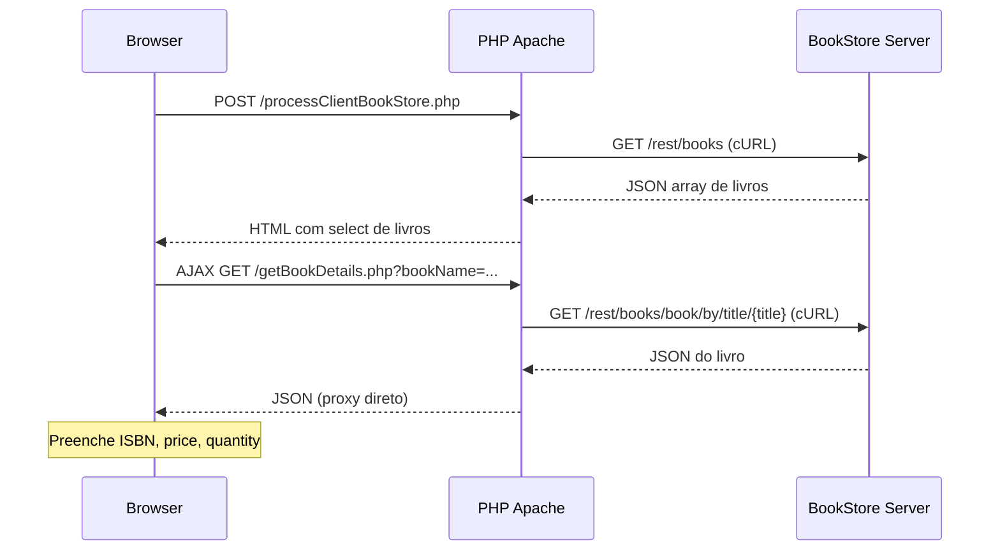
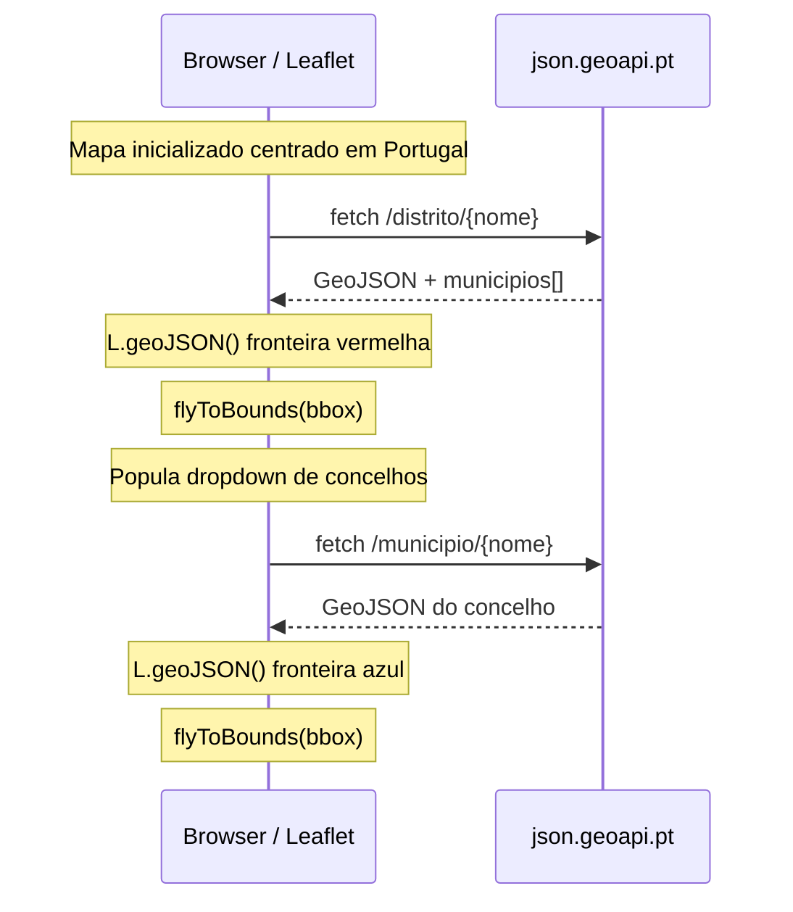

# Aula Prática 04 – Web Services — Relatório

**Instituto Superior de Engenharia de Lisboa**
Departamento de Engenharia Informática — LEIM
Sistemas Multimédia para a Internet – Semestre de Verão 2025/2026

---

## Índice

1. [Introdução](#1-introdução)
2. [Tarefa 1 — Cliente SOAP (PHP + Java)](#2-tarefa-1--cliente-soap-php--java)
3. [Tarefa 2 — Cliente REST BookStore (PHP + Java)](#3-tarefa-2--cliente-rest-bookstore-php--java)
4. [Tarefa 3 — Web Service REST Próprio (Java JAX-RS + Python)](#4-tarefa-3--web-service-rest-próprio-java-jax-rs--python)
5. [Tarefa 4 — Integração de OpenStreetMap (PHP + JavaScript)](#5-tarefa-4--integração-de-openstreetmap-php--javascript)
6. [Decisões de Desenho](#6-decisões-de-desenho)
7. [Conclusão](#7-conclusão)

---

## 1. Introdução

Este relatório documenta o trabalho realizado no âmbito da Aula Prática 04 da unidade curricular de Sistemas Multimédia para a Internet. O objetivo foi consolidar conhecimentos sobre **Web Services**, abrangendo o desenvolvimento e consumo de serviços SOAP e REST em múltiplas linguagens.

Foram implementadas quatro tarefas:

| #   | Tarefa                          | Linguagens             | Entregáveis                                                                |
| --- | ------------------------------- | ---------------------- | -------------------------------------------------------------------------- |
| 1   | Cliente SOAP                    | PHP + Java             | `php-number-conversion-client/`, `java-number-conversion-client/`          |
| 2   | Cliente REST BookStore          | PHP + Java             | `php-bookstore-client/`, `java-bookstore-client/`, `BookStore/` (servidor) |
| 3   | Servidor + Cliente REST próprio | Java (JAX-RS) + Python | `java-rest-server/`, `python-rest-client/`                                 |
| 4   | OpenStreetMap                   | PHP + JavaScript       | `php-openstreetmap/`                                                       |

Todo o ambiente é orquestrado via Docker Compose (`compose.yaml`), permitindo executar todas as tarefas sem dependências locais.

---

## 2. Tarefa 1 — Cliente SOAP (PHP + Java)

### 2.1 Objetivo

Desenvolver dois clientes que consumam o Web Service SOAP **NumberConversion** da DataAccess:

- WSDL: `https://www.dataaccess.com/webservicesserver/NumberConversion.wso?WSDL`
- Operações: `NumberToDollars` (número → texto em dólares) e `NumberToWords` (número → palavras)

**Resultado esperado:** Ambos os clientes invocam as duas operações com os mesmos valores de teste (15.99 e 12344) e apresentam as respostas em texto — por exemplo, `"fifteen dollars and ninety nine cents"` e `"twelve thousand three hundred and forty four"`.

### 2.2 Cliente PHP — `php-number-conversion-client/`

O cliente PHP utiliza a classe nativa `SoapClient`, que permite consumir qualquer serviço SOAP a partir do seu WSDL sem geração de código.

**Estrutura:** Ficheiro único `index.php`.

**Código relevante — invocação SOAP:**

```php
$wsdl  = "https://www.dataaccess.com/webservicesserver/NumberConversion.wso?WSDL";
$proxy = new SoapClient($wsdl, ["cache_wsdl" => WSDL_CACHE_NONE]);

// NumberToDollars
$arg1    = ["dNum" => 15.99];
$result1 = $proxy->NumberToDollars($arg1)->NumberToDollarsResult;

// NumberToWords
$arg2    = ["ubiNum" => 12344];
$result2 = $proxy->NumberToWords($arg2)->NumberToWordsResult;
```

**Pontos-chave:**

- O `SoapClient` descobre automaticamente as operações disponíveis a partir do WSDL.
- Os argumentos são passados como arrays associativos, cujas chaves correspondem aos nomes dos parâmetros definidos no WSDL.
- A página também utiliza `__getFunctions()` para listar as operações disponíveis, servindo de ferramenta de introspecção.

### 2.3 Cliente Java — `java-number-conversion-client/`

O cliente Java utiliza **Apache CXF** para gerar stubs tipados a partir do WSDL em tempo de compilação, e **JAX-WS RT** como runtime.

**Estrutura:** Projeto Maven com `pom.xml` + classe `smi.client.Main`.

**Geração de código (pom.xml):**

```xml
<plugin>
    <groupId>org.apache.cxf</groupId>
    <artifactId>cxf-codegen-plugin</artifactId>
    <version>4.0.4</version>
    <configuration>
        <wsdlOptions>
            <wsdlOption>
                <wsdl>https://www.dataaccess.com/.../NumberConversion.wso?WSDL</wsdl>
                <extraargs>
                    <extraarg>-p</extraarg>
                    <extraarg>com.dataaccess.numberconversion</extraarg>
                </extraargs>
            </wsdlOption>
        </wsdlOptions>
    </configuration>
</plugin>
```

O plugin `cxf-codegen-plugin` executa durante a fase `generate-sources`, produzindo classes Java no pacote `com.dataaccess.numberconversion`.

**Código relevante — invocação tipada:**

```java
NumberConversion service = new NumberConversion();
NumberConversionSoapType port = service.getNumberConversionSoap();

// NumberToDollars
String dollars = port.numberToDollars(new BigDecimal("15.99"));

// NumberToWords
String words = port.numberToWords(BigInteger.valueOf(12344));
```

### 2.4 Comparação PHP vs. Java

| Aspeto              | PHP                            | Java                                  |
| ------------------- | ------------------------------ | ------------------------------------- |
| Mecanismo SOAP      | `SoapClient` nativo            | Stubs gerados pelo CXF                |
| Segurança de tipos  | Dinâmica (arrays associativos) | Estática (`BigDecimal`, `BigInteger`) |
| Setup necessário    | Nenhum — basta o URL do WSDL   | Plugin Maven + geração de código      |
| Estilo de invocação | `$proxy->op(["param" => val])` | `port.op(typedValue)`                 |

---

## 3. Tarefa 2 — Cliente REST BookStore (PHP + Java)

### 3.1 Objetivo

Consumir o serviço REST **BookStore**, que expõe uma API com listagem de livros e consulta por título/ISBN.

**Resultado esperado:** O cliente PHP apresenta uma página web com a lista dos 4 livros disponíveis num dropdown. Ao selecionar um livro, os seus detalhes (ISBN, preço, quantidade) são carregados via AJAX e apresentados juntamente com a capa obtida do Open Library. O cliente Java imprime a mesma informação na consola.

### 3.2 Servidor BookStore — `BookStore/`

O servidor é uma aplicação WAR baseada em **Jersey 1.x** (JAX-RS 1.1) + **Tomcat 9**. A API é definida na classe `BookController`:

```java
@Path("/books")
public class BookController {

    @GET @Produces(MediaType.APPLICATION_JSON)
    public List<Book> getBooks() { ... }

    @GET @Path("/book/by/title/{title}")
    @Produces(MediaType.APPLICATION_JSON)
    public Book getBookByTitle(@PathParam("title") String title) { ... }

    @GET @Path("/book/by/isbn/{isbn}")
    @Produces(MediaType.APPLICATION_JSON)
    public Book getBookByISBN(@PathParam("isbn") String isbn) { ... }
}
```

O `BookService` mantém 4 livros em memória (HashMap), inicializados de forma thread-safe.

### 3.3 Endpoints da API

| Método | Endpoint                            | Resposta                                             |
| ------ | ----------------------------------- | ---------------------------------------------------- |
| `GET`  | `/rest/books`                       | Array JSON de todos os livros                        |
| `GET`  | `/rest/books/book/by/title/{title}` | Objeto JSON com `title`, `isbn`, `price`, `quantity` |
| `GET`  | `/rest/books/book/by/isbn/{isbn}`   | Objeto JSON (livro completo)                         |
| `GET`  | `/rest/books/store/name`            | `{"storeName": "REST Book Store - SMI"}`             |

### 3.4 Cliente PHP — `php-bookstore-client/`

O cliente PHP é uma aplicação web com três componentes principais:

1. **`index.php`** — Formulário com dropdown de URLs (carregados de `services.xml`).
2. **`processClientBookStore.php`** — Recebe o URL, faz `GET` via cURL e renderiza a lista de livros.
3. **`getBookDetails.php`** — Endpoint AJAX que obtém os detalhes de um livro por título.

**Fluxo de dados:**



**Código relevante — chamada cURL e descodificação JSON (`processClientBookStore.php`):**

```php
$result   = CurlHelper::perform_http_request("GET", $uri);
$bookList = json_decode($result, true);

$numberOfBooks = count($bookList);
```

**Código relevante — proxy AJAX (`getBookDetails.php`):**

```php
$uriWithArgs = $uri . "/book/by/title/" . rawurlencode($bookName);
echo CurlHelper::perform_http_request("GET", $uriWithArgs);
```

### 3.5 Cliente Java — `java-bookstore-client/`

O cliente Java utiliza `java.net.http.HttpClient` (JDK 11+) e **Gson 2.11** para consumir a mesma API.

**Estrutura:** Projeto Maven com `Book.java` (POJO) + `BookStoreClient.java`.

**Código relevante — listagem e consulta:**

```java
// 1. Listar todos os livros
String listJson = get(baseUrl);
List<Book> books = gson.fromJson(listJson, BOOK_LIST_TYPE);

// 2. Obter detalhes de um livro por título
String encoded   = URLEncoder.encode(title, StandardCharsets.UTF_8);
String detailUrl = baseUrl + "/book/by/title/" + encoded;
Book detail      = gson.fromJson(get(detailUrl), Book.class);
```

**Código relevante — método HTTP GET:**

```java
private String get(String url) {
    HttpRequest request = HttpRequest.newBuilder()
        .uri(URI.create(url))
        .header("Accept", "application/json")
        .GET()
        .build();

    HttpResponse<String> response =
        httpClient.send(request, HttpResponse.BodyHandlers.ofString());

    if (response.statusCode() / 100 != 2) return null;
    return response.body();
}
```

O URL base é configurável pela variável de ambiente `BOOKSTORE_URL`, com default para `http://java-bookstore-server:8080/ServiceBookStoreREST-Tomcat/rest/books` (hostname do contentor Docker).

---

## 4. Tarefa 3 — Web Service REST Próprio (Java JAX-RS + Python)

### 4.1 Objetivo

Implementar um servidor REST em Java com duas operações e um cliente que as consuma.

**Resultado esperado:** O servidor responde com JSON a pedidos `GET`. O cliente Python imprime na consola a data/hora do servidor e o resultado da conversão para maiúsculas — por exemplo, `"HELLO WORLD"` para o input `"hello world"`.

### 4.2 Servidor Java — `java-rest-server/`

O servidor segue o padrão do exemplo `Server-JAX-RS`, utilizando **Jersey 3.1.10** (Jakarta EE) + **Grizzly** como servidor HTTP embebido.

**Estrutura do projeto:**

| Classe             | Responsabilidade                                          |
| ------------------ | --------------------------------------------------------- |
| `RestServerApp`    | Ponto de entrada — inicia o Grizzly em `0.0.0.0:8083/api` |
| `RestServerConfig` | Configuração Jersey — regista JSON-B e filtro CORS        |
| `RestService`      | Define os dois endpoints REST                             |
| `CorsFilter`       | Filtro de resposta que adiciona headers CORS              |

**Código relevante — endpoints (`RestService.java`):**

```java
@Path("/")
public class RestService {

    @GET @Path("/datetime") @Produces(MediaType.APPLICATION_JSON)
    public DateTimeResponse getServerDateTime() {
        String now = LocalDateTime.now()
            .format(DateTimeFormatter.ISO_LOCAL_DATE_TIME);
        return new DateTimeResponse(now);
    }

    @GET @Path("/toupper") @Produces(MediaType.APPLICATION_JSON)
    public ToUpperResponse toUpper(@QueryParam("text") String text) {
        if (text == null) text = "";
        return new ToUpperResponse(text, text.toUpperCase());
    }
}
```

Cada endpoint devolve um POJO que é automaticamente serializado para JSON via **JSON-B** (registado em `RestServerConfig`).

**Código relevante — bootstrap do servidor (`RestServerApp.java`):**

```java
String endpoint = String.format("http://0.0.0.0:%d/api", PORT);
ResourceConfig config = new RestServerConfig();
HttpServer server = GrizzlyHttpServerFactory.createHttpServer(
    URI.create(endpoint), config);

Runtime.getRuntime().addShutdownHook(new Thread(server::shutdownNow));
Thread.currentThread().join();
```

Utiliza-se `0.0.0.0` (em vez de `localhost`) para que o serviço seja acessível a partir de outros contentores Docker. O `Thread.join()` bloqueia a thread principal indefinidamente, sendo a terminação feita via shutdown hook (e.g., `docker stop`).

**Filtro CORS (`CorsFilter.java`):**

```java
@Provider
public class CorsFilter implements ContainerResponseFilter {
    @Override
    public void filter(ContainerRequestContext req, ContainerResponseContext res) {
        res.getHeaders().add("Access-Control-Allow-Origin", "*");
        res.getHeaders().add("Access-Control-Allow-Methods",
            "GET, POST, PUT, DELETE, OPTIONS");
        res.getHeaders().add("Access-Control-Allow-Headers", "*");
    }
}
```

### 4.3 Endpoints da API

| Método | Endpoint                  | Exemplo de Resposta                        |
| ------ | ------------------------- | ------------------------------------------ |
| `GET`  | `/api/datetime`           | `{"dateTime": "2026-05-26T14:30:00"}`      |
| `GET`  | `/api/toupper?text=hello` | `{"original": "hello", "result": "HELLO"}` |

### 4.4 Cliente Python — `python-rest-client/`

O cliente utiliza **httpx** e é executado via **uv** (gestor de dependências Python). As dependências são declaradas inline usando PEP 723:

```python
# /// script
# requires-python = ">=3.12"
# dependencies = ["httpx>=0.27"]
# ///
```

Isto permite ao `uv run main.py` instalar automaticamente o `httpx` sem necessidade de `requirements.txt` ou `pyproject.toml`.

**Código relevante — chamadas aos dois endpoints:**

```python
BASE_URL = os.getenv("REST_SERVER_URL", "http://java-rest-server:8083")

def get_datetime(client: httpx.Client) -> None:
    resp = client.get(f"{BASE_URL}/api/datetime")
    resp.raise_for_status()
    data = resp.json()
    print(f"  Server date/time: {data['dateTime']}")

def to_upper(client: httpx.Client, text: str) -> None:
    resp = client.get(f"{BASE_URL}/api/toupper", params={"text": text})
    resp.raise_for_status()
    data = resp.json()
    print(f"  Original: {data['original']}")
    print(f"  Result  : {data['result']}")
```

O cliente trata erros de conexão com uma mensagem explicativa que indica como iniciar o servidor.

---

## 5. Tarefa 4 — Integração de OpenStreetMap (PHP + JavaScript)

### 5.1 Objetivo

Substituir os mapas estáticos (imagens GIF dos distritos) do exemplo `06-Forms` por um mapa interativo OpenStreetMap usando **Leaflet.js**, com fronteiras GeoJSON obtidas da API **GeoAPI.pt**.

**Resultado esperado:** Ao selecionar "Lisboa" no dropdown, o mapa desenha o polígono vermelho da fronteira do distrito e faz zoom automático para o enquadrar. O dropdown de concelhos é populado com os 16 municípios de Lisboa. Ao selecionar "Cascais", surge um segundo polígono azul sobreposto, com zoom para o concelho.

### 5.2 Abordagem

Em vez de modificar diretamente o `06-Forms` (que depende de uma base de dados MySQL para os selects), foi criada uma implementação autónoma em `php-openstreetmap/` que reproduz a funcionalidade relevante — dropdowns de distrito e concelho com mapa interativo — sem dependências externas de base de dados.

Os 18 distritos de Portugal continental são definidos diretamente no PHP. Os concelhos são obtidos dinamicamente da resposta da API GeoAPI.pt quando um distrito é selecionado.

### 5.3 Estrutura do Projeto

| Ficheiro         | Função                                                      |
| ---------------- | ----------------------------------------------------------- |
| `index.php`      | Página principal — layout com dropdowns e mapa              |
| `scripts/map.js` | Inicialização do mapa, handlers de eventos, chamadas GeoAPI |
| `styles/map.css` | Estilos CSS — layout flexbox, dimensões do mapa             |

### 5.4 Funcionamento



Em detalhe:

1. A página carrega com o mapa Leaflet centrado em Portugal (lat 39.5, lng -8.0, zoom 7).
2. O utilizador seleciona um **distrito** — o JavaScript faz `fetch()` a `json.geoapi.pt/distrito/{nome}`.
3. A resposta contém o GeoJSON da fronteira e a lista de municípios.
4. A fronteira é desenhada (a vermelho) e o mapa faz `flyToBounds()`.
5. O dropdown de concelhos é populado com os municípios recebidos.
6. Se o utilizador selecionar um **concelho**, repete-se o processo com fronteira a azul.
7. Camadas anteriores são removidas a cada nova seleção.

### 5.5 Código Relevante

**Inicialização do mapa (`map.js`):**

```javascript
function initMap() {
  theMap = L.map("map", {
    center: [39.5, -8.0],
    zoom: 7,
  });

  L.tileLayer("https://{s}.tile.openstreetmap.org/{z}/{x}/{y}.png", {
    attribution: "&copy; OpenStreetMap",
    maxZoom: 19,
  }).addTo(theMap);
}
```

**Seleção de distrito — fetch GeoJSON + flyToBounds:**

```javascript
fetch(GEOAPI_BASE + "/distrito/" + encodeURIComponent(districtName))
  .then(function (r) {
    return r.json();
  })
  .then(function (json) {
    var geojson = json.geojson;
    var bbox = geojson.bbox;

    layerDistrict = L.geoJSON(geojson, {
      color: "red",
      weight: 2,
      fillOpacity: 0.1,
    });
    layerDistrict.addTo(theMap);

    theMap.flyToBounds(
      L.latLngBounds(L.latLng(bbox[1], bbox[0]), L.latLng(bbox[3], bbox[2])),
    );

    // Popula dropdown de concelhos
    var municipios = json.municipios || [];
    municipios.sort().forEach(function (name) {
      var opt = document.createElement("option");
      opt.value = name;
      opt.textContent = name;
      countySelect.appendChild(opt);
    });
  });
```

**Seleção de concelho — fetch + overlay azul:**

```javascript
fetch(GEOAPI_BASE + "/municipio/" + encodeURIComponent(countyName))
  .then(function (r) {
    return r.json();
  })
  .then(function (json) {
    var geojson = json.geojsons && json.geojsons.municipio;
    var bbox = geojson.bbox;

    layerCounty = L.geoJSON(geojson, {
      color: "blue",
      weight: 2,
      fillOpacity: 0.15,
    });
    layerCounty.addTo(theMap);

    theMap.flyToBounds(
      L.latLngBounds(L.latLng(bbox[1], bbox[0]), L.latLng(bbox[3], bbox[2])),
    );
  });
```

### 5.6 APIs Utilizadas

| API                  | Utilização                                            | URL                                                                 |
| -------------------- | ----------------------------------------------------- | ------------------------------------------------------------------- |
| **Leaflet.js 1.9.4** | Renderização do mapa, layers GeoJSON, `flyToBounds()` | CDN unpkg.com                                                       |
| **GeoAPI.pt**        | GeoJSON dos distritos e municípios portugueses        | `json.geoapi.pt/distrito/{nome}`, `json.geoapi.pt/municipio/{nome}` |

### 5.7 Correspondência com os Requisitos

| Requisito do enunciado                               | Implementação                                    |
| ---------------------------------------------------- | ------------------------------------------------ |
| Leaflet CSS + JS na página                           | Carregados via CDN na `index.php`                |
| `<div id="map">` em vez de imagens estáticas         | `<div id="map">` com layout flexbox              |
| `L.map()` centrado em Portugal (~39.5, -8.0, zoom 7) | Inicializado em `initMap()`                      |
| `onchange` do distrito → fetch GeoAPI → GeoJSON      | Handler `onDistrictChange()` com `fetch()`       |
| `L.geoJSON()` + `flyToBounds()`                      | Aplicados tanto para distritos como concelhos    |
| Remover camada anterior ao trocar                    | `removeLayer()` chamado antes de cada novo fetch |
| Concelho (opcional)                                  | Implementado com fronteira azul                  |

---

## 6. Decisões de Desenho

Ao longo da implementação das quatro tarefas, foram tomadas algumas decisões técnicas que merecem justificação:

| Decisão                                             | Motivo                                                                                                                                                                                                                                 |
| --------------------------------------------------- | -------------------------------------------------------------------------------------------------------------------------------------------------------------------------------------------------------------------------------------- |
| **Tomcat 9** em vez de 10+ para o BookStore         | O servidor BookStore utiliza Jersey 1.x, que depende do namespace `javax.servlet`. O Tomcat 10+ migrou para `jakarta.servlet` (Jakarta EE 9), tornando-o incompatível.                                                                 |
| **Grizzly bound a `0.0.0.0`** em vez de `localhost` | O servidor da Tarefa 3 corre dentro de um contentor Docker. Fazer bind a `localhost` (127.0.0.1) impediria que outros contentores na mesma rede alcançassem o serviço.                                                                 |
| **PEP 723 + uv** em vez de `requirements.txt`       | A especificação PEP 723 permite declarar dependências inline no próprio script Python, eliminando ficheiros auxiliares. O gestor `uv` lê estes metadados e instala as dependências automaticamente ao executar `uv run main.py`.       |
| **`pom.xml` tornado autónomo** no BookStore         | O `pom.xml` original referenciava um parent POM (`smi.ws.java.rest.extra`) não disponível fora do repositório de exemplos. Foi removida a referência e adicionaram-se versões explícitas dos plugins Maven.                            |
| **Task 4 autónoma** em vez de modificar `06-Forms`  | O exemplo `06-Forms` depende de uma base de dados MySQL para popular os dropdowns de distritos/concelhos. Para evitar essa dependência, criou-se uma implementação autónoma que obtém a mesma informação diretamente da API GeoAPI.pt. |
| **Jersey 3.1 (Jakarta EE)** para a Tarefa 3         | A Tarefa 3 foi implementada de raiz, sem restrições de retrocompatibilidade. Optou-se pela versão atual do Jersey (3.1.10) com o namespace `jakarta.*`, alinhada com o exemplo `Server-JAX-RS` fornecido.                              |

---

## 7. Conclusão

As quatro tarefas foram implementadas na totalidade, cobrindo os principais paradigmas de Web Services abordados na unidade curricular:

- **SOAP** (Tarefa 1) — Demonstrou a diferença entre o consumo dinâmico em PHP (SoapClient) e o consumo tipado em Java (CXF/wsdl2java).
- **REST — consumo** (Tarefa 2) — Implementou clientes em PHP (cURL + AJAX) e Java (HttpClient + Gson) para a mesma API, incluindo a containerização do servidor BookStore.
- **REST — desenvolvimento** (Tarefa 3) — Criou um servidor JAX-RS completo com Jersey 3.1 + Grizzly e um cliente Python com httpx, demonstrando interoperabilidade entre linguagens.
- **Integração de mapas** (Tarefa 4) — Substituiu imagens estáticas por um mapa interativo Leaflet.js com fronteiras GeoJSON obtidas da GeoAPI.pt.

Toda a infraestrutura é reproduzível via Docker Compose com um único comando (`docker compose up`), facilitando a demonstração e avaliação do trabalho.

### Estrutura Final do Projeto

```
tutorial-4/
├── compose.yaml
├── README.md
├── REPORT.md
│
├── php-number-conversion-client/    ← Tarefa 1 (PHP SOAP)
│   └── index.php
│
├── java-number-conversion-client/   ← Tarefa 1 (Java SOAP)
│   ├── pom.xml
│   └── src/.../Main.java
│
├── BookStore/                       ← Tarefa 2 (Servidor)
│   ├── Dockerfile
│   ├── pom.xml
│   └── src/.../controller/BookController.java
│
├── php-bookstore-client/            ← Tarefa 2 (PHP REST)
│   ├── Dockerfile
│   ├── index.php
│   ├── processClientBookStore.php
│   ├── getBookDetails.php
│   └── CurlHelper.php
│
├── java-bookstore-client/           ← Tarefa 2 (Java REST)
│   ├── pom.xml
│   └── src/.../BookStoreClient.java
│
├── java-rest-server/                ← Tarefa 3 (Servidor)
│   ├── pom.xml
│   └── src/.../restserver/
│       ├── RestServerApp.java
│       ├── RestServerConfig.java
│       ├── RestService.java
│       └── CorsFilter.java
│
├── python-rest-client/              ← Tarefa 3 (Cliente)
│   └── main.py
│
└── php-openstreetmap/               ← Tarefa 4
    ├── index.php
    ├── scripts/map.js
    └── styles/map.css
```
